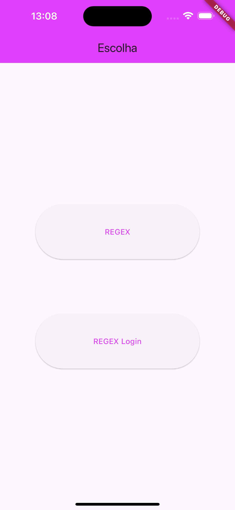
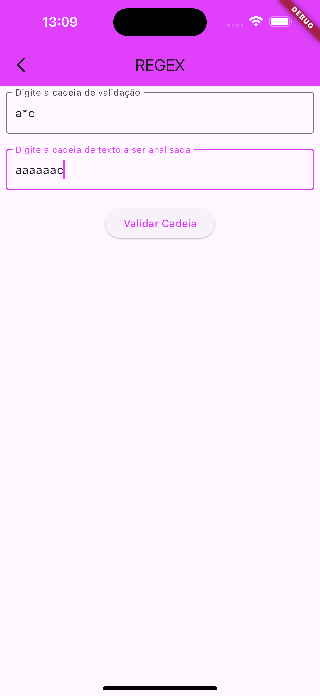
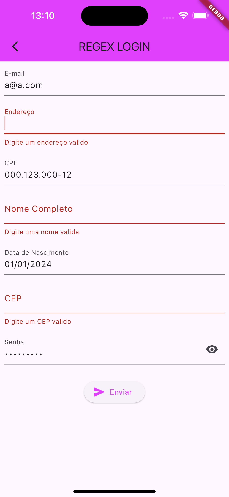

# Regex
Este aplicativo foi feito através da matéria de DFA, com intuito de aprender REGEX

### O que eu aprendi neste aplicativo
Aprendi a fazer verificação de campos de texto, como email, senha, cpf, cep e endereço
 

### Layout

  

#### GIFS

> :construction: Projeto em construção :construction:

### Tecnologias utilizadas
- ``VSCode``
- ``Dart``
- ``Flutter``
- ``XCode = Emulador de IOs``
- ``Android Studio = Emulador Android``
- ``iPad = Emulador iPadOS``

